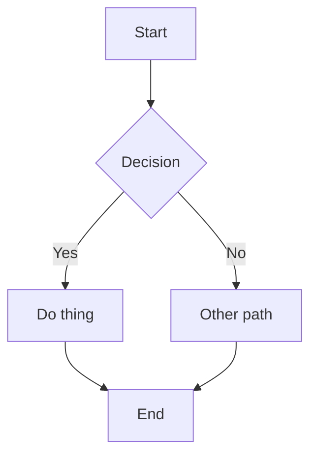

# <% tp.file.title %>

## Mermaid Flow

```mermaid
flowchart TD
  A[Start] --> B{Decision}
  B -- Yes --> C[Do thing]
  B -- No --> D[Other path]
  C --> E[End]
  D --> E[End]
```

## Canvas
Consider using Canvas files for complex diagrams.
